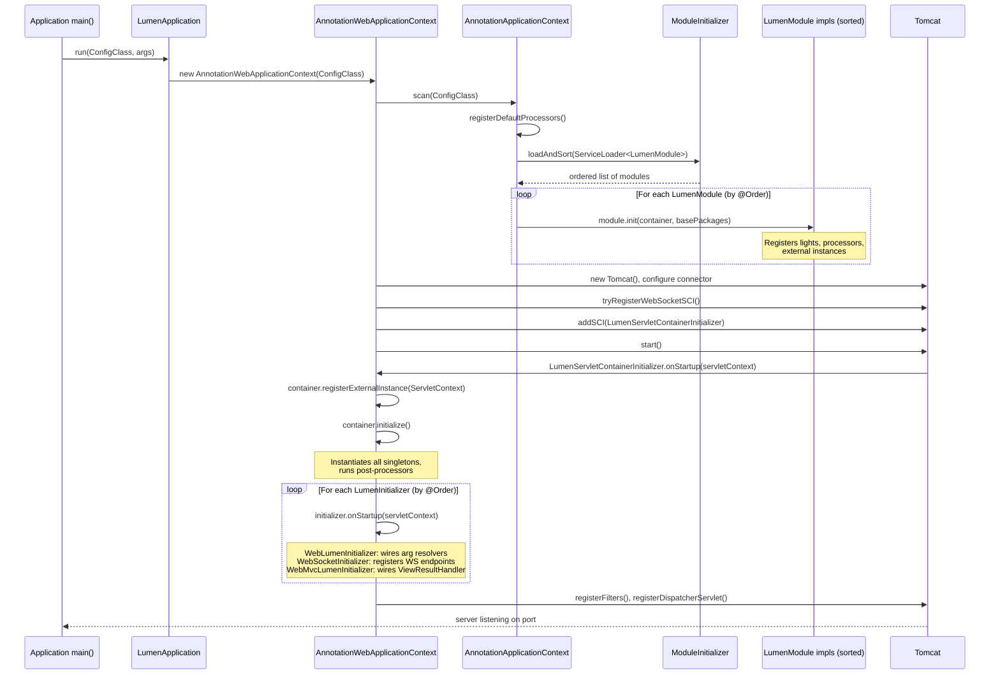
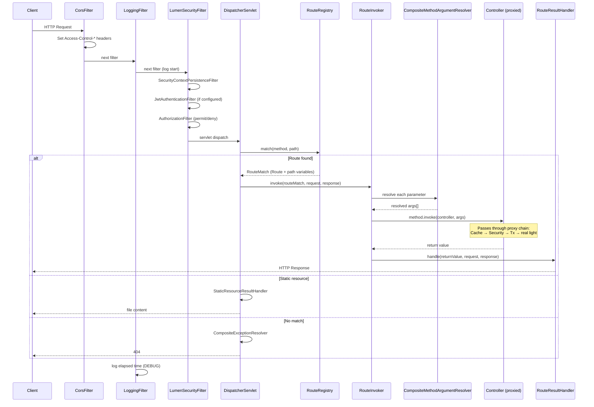
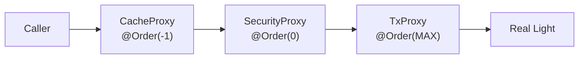

# Lumen Framework — Software Architecture Document

**Version:** 0.1.0-SNAPSHOT  
**Author:** David Stefanovic  
**Date:** 2026-06-01

---

## Table of Contents

1. [Introduction](#1-introduction)
2. [Architectural Goals](#2-architectural-goals)
3. [Boot-First Architecture](#3-boot-first-architecture)
4. [Module Overview](#4-module-overview)
5. [Module Dependency Graph](#5-module-dependency-graph)
6. [IoC Container](#6-ioc-container)
7. [Startup and Boot Sequence](#7-startup-and-boot-sequence)
8. [HTTP Request Lifecycle](#8-http-request-lifecycle)
9. [Proxy and Post-Processor Chain](#9-proxy-and-post-processor-chain)
10. [Cross-Cutting Concerns](#10-cross-cutting-concerns)
11. [SPI Extension Points](#11-spi-extension-points)
12. [Technology Stack](#12-technology-stack)

---

## 1. Introduction

Lumen is a lightweight, annotation-driven Java web framework inspired by Spring Framework. It provides an inversion-of-control (IoC) container, a servlet-based web layer, declarative data access, security, caching, asynchronous execution, WebSocket support, mail integration, and template rendering — all wired together automatically when the appropriate modules are added to the classpath.

The framework is implemented entirely from scratch against Java 25 and Jakarta EE APIs, with no dependency on Spring or any other framework at runtime. It targets developers who want a Spring-like programming model without the full Spring ecosystem, and serves as a reference implementation of the core patterns that make such frameworks work: dependency injection, AOP-based proxying, filter chains, and SPI-based autoconfiguration.

---

## 2. Architectural Goals

| Goal | Description |
|---|---|
| **Simplicity** | The entire framework fits in a multi-module Maven project; no annotation processors, no code generation. |
| **Familiar API** | Annotations and class names mirror Spring to minimise the learning curve. |
| **Boot-first** | Autoconfiguration is the default and only supported mode; every module wires itself when it appears on the classpath. |
| **Testability** | All cross-cutting behaviour (caching, security, transactions) is implemented as proxy interceptors, making it straightforward to test components in isolation. |
| **Extensibility** | Key seams are SPI interfaces: `LumenModule`, `LightProcessor`, `LumenInitializer`, `ProxyProvider`, `CacheManager`. New capabilities can be added without modifying existing modules. |

---

## 3. Boot-First Architecture

Lumen is a **boot-first** framework. This means autoconfiguration is not optional — every internal module registers its lights via a `LumenModule` implementation, which is discovered at startup through the Java `ServiceLoader` mechanism.

### What "boot-first" means in practice

When a user adds `lumen-boot-starter-web` to their project, the following happens automatically:

- `lumen-boot` is pulled in transitively and loads `application.properties`
- `lumen-web` registers the `DispatcherServlet`, `RouteRegistry`, and argument resolvers
- `lumen-web-mvc` registers `ViewResultHandler`
- `lumen-aop` registers the `ByteBuddyProxyProvider`

Users never import internal modules (`lumen-core`, `lumen-web`, etc.) directly. They only ever declare starters:

```xml
<!-- Correct — user's application pom.xml -->
<dependency>
    <groupId>io.lumen</groupId>
    <artifactId>lumen-boot-starter-web</artifactId>
    <version>0.1.0-SNAPSHOT</version>
</dependency>
```

The `lumen-boot` module is the **entry point for every application**. It loads the property files and provides `LumenApplication.run()`. Without it, no other module can initialise — the `Environment` light would be absent and property-driven configuration would fail.

### LumenModule SPI — the autoconfiguration mechanism

`LumenModule` is the Lumen equivalent of Spring Boot's `@AutoConfiguration`. Each module ships exactly one implementation:

```java
public interface LumenModule {
    void init(LightContainer container, String... basePackages);
}
```

Modules are sorted by `@Order` before execution, which determines both the registration order of lights and the wrapping order of proxies.

---

## 4. Module Overview

### Internal modules

These are implementation details. They must never appear as direct dependencies in an application's `pom.xml`.

| Module | `@Order` | Responsibility |
|---|---|---|
| `lumen-core` | — | IoC container, DI, scopes, proxy SPI, event API |
| `lumen-context` | — | Annotation config, component scan, conditional evaluation, event multicasting |
| `lumen-aop` | — | ByteBuddy proxy provider (five proxy strategies) |
| `lumen-gleam` | — | Gleam expression engine (library, no `LumenModule`); used by security and cache |
| `lumen-boot` | `MIN_VALUE` | `application.properties` loading, `LumenApplication.run()` |
| `lumen-security` | `0` | Filter chain, authentication, `@PreAuthorize`/`@PostAuthorize` |
| `lumen-web` | `1` | `DispatcherServlet`, routing, argument resolution, CORS, exception handling |
| `lumen-web-mvc` | — | `ModelAndView`, `ViewResolver` interface, `ViewResultHandler` |
| `lumen-validation` | `2` | `@Valid`, constraint annotations, 422 responses |
| `lumen-async` | `3` | `@Async` (thread pool), `@Scheduled` (fixed rate/delay/cron) |
| `lumen-websocket` | `4` | JSR-356 WebSocket endpoints, origin validation |
| `lumen-mail` | `2` | `MailSender`, `JavaMailSender`, `MimeMessageHelper` |
| `lumen-cache` | `-1` | `@Cacheable`/`@CacheEvict`/`@CachePut`, `CacheManager` SPI |
| `lumen-data` | `MAX` | JPA repositories, derived queries, `@Transactional` |
| `lumen-migration` | — | `DatabaseMigrator` SPI interface + `NoOpDatabaseMigrator`; no `LumenModule` |
| `lumen-boot-thymeleaf` | `2` | `TemplateEngine` light; conditional `ThymeleafViewResolver` |
| `lumen-boot-flyway` | `6` | Flyway database migration; runs before `lumen-data` |
| `lumen-boot-actuator` | `10` | Health/info/env/lights HTTP endpoints; optional security via `SecurityRuleContributor` |

### User-facing starters

These are the only modules a user should import.

| Starter | What it pulls in |
|---|---|
| `lumen-boot-starter` | core + context + aop + boot |
| `lumen-boot-starter-web` | starter + web + web-mvc |
| `lumen-boot-starter-thymeleaf` | starter-web + boot-thymeleaf |
| `lumen-boot-starter-data-jpa` | starter + data + Hibernate + H2 + HikariCP |
| `lumen-boot-starter-security` | starter + security |
| `lumen-boot-starter-validation` | starter + validation |
| `lumen-boot-starter-cache` | starter + cache |
| `lumen-boot-starter-websocket` | starter-web + websocket |
| `lumen-boot-starter-async` | starter + async |
| `lumen-boot-starter-mail` | starter + mail + Angus Mail |
| `lumen-boot-starter-flyway` | starter + boot-flyway (Flyway) |
| `lumen-boot-starter-actuator` | starter-web + boot-actuator |

---

## 5. Module Dependency Graph

The diagram below shows how starters depend on internal modules. Arrows point from dependent to dependency.

```mermaid
graph TD
    subgraph "User-facing starters"
        S_BASE[lumen-boot-starter]
        S_WEB[lumen-boot-starter-web]
        S_TL[lumen-boot-starter-thymeleaf]
        S_DATA[lumen-boot-starter-data-jpa]
        S_SEC[lumen-boot-starter-security]
        S_VAL[lumen-boot-starter-validation]
        S_CACHE[lumen-boot-starter-cache]
        S_WS[lumen-boot-starter-websocket]
        S_ASYNC[lumen-boot-starter-async]
        S_MAIL[lumen-boot-starter-mail]
        S_FLY[lumen-boot-starter-flyway]
        S_ACT[lumen-boot-starter-actuator]
    end

    subgraph "Internal modules"
        CORE[lumen-core]
        CTX[lumen-context]
        AOP[lumen-aop]
        BOOT[lumen-boot]
        WEB[lumen-web]
        MVC[lumen-web-mvc]
        SEC[lumen-security]
        DATA[lumen-data]
        VAL[lumen-validation]
        CACHE[lumen-cache]
        WS[lumen-websocket]
        ASYNC[lumen-async]
        MAIL[lumen-mail]
        TL[lumen-boot-thymeleaf]
        MIG[lumen-migration]
        FLY[lumen-boot-flyway]
        ACT[lumen-boot-actuator]
    end

    S_BASE --> CORE
    S_BASE --> CTX
    S_BASE --> AOP
    S_BASE --> BOOT

    S_WEB --> S_BASE
    S_WEB --> WEB
    S_WEB --> MVC

    S_TL --> S_WEB
    S_TL --> TL

    S_DATA --> S_BASE
    S_DATA --> DATA

    S_SEC --> S_BASE
    S_SEC --> SEC

    S_VAL --> S_BASE
    S_VAL --> VAL

    S_CACHE --> S_BASE
    S_CACHE --> CACHE

    S_WS --> S_WEB
    S_WS --> WS

    S_ASYNC --> S_BASE
    S_ASYNC --> ASYNC

    S_MAIL --> S_BASE
    S_MAIL --> MAIL

    S_FLY --> S_BASE
    S_FLY --> FLY

    S_ACT --> S_WEB
    S_ACT --> ACT

    CTX --> CORE
    AOP --> CORE
    WEB --> CTX
    MVC --> WEB
    SEC --> CTX
    DATA --> CTX
    VAL --> CORE
    CACHE --> CORE
    WS --> WEB
    ASYNC --> CORE
    MAIL --> CORE
    TL --> CTX
    FLY --> MIG
    FLY --> CTX
    ACT --> CTX
```



---

## 6. IoC Container

The IoC container is implemented in `lumen-core` and is the foundation of the entire framework.

### Core classes

| Class | Role |
|---|---|
| `LightContainer` | Central registry. Stores `LightDefinition` entries keyed by type. |
| `LightDefinition` | Blueprint for a light: its class, origin (CLASS / INSTANCE / FACTORY), scope, and conditions. |
| `DefaultLightCreator` | Orchestrates instantiation: runs the pre-processor chain, instantiates, runs the post-processor chain. |
| `LightResolver` | Resolves dependencies by type; detects circular dependencies via an in-progress set. |
| `LightInstance` | A live light after instantiation, together with its resolved dependencies. |

### Dependency injection

Three injection modes are supported:

1. **Constructor injection** — the primary mode; dependencies are resolved from constructor parameters.
2. **Field injection** — `@Inject` on a field; uses reflection to set the value after construction.
3. **Setter injection** — `@Inject` on a setter method; called after the instance is constructed.

All three modes are implemented as `InjectionStep` implementations and composed in `DefaultLightCreator`.

### Light scopes

| Scope | Behaviour |
|---|---|
| `SINGLETON` (default) | One instance per container; created on `initialize()`. |
| `PROTOTYPE` | New instance on every `getLight()` call. |
| `REQUEST` | One instance per HTTP request (web layer). |
| `SESSION` | One instance per HTTP session (web layer). |

### Conditionals

`@ConditionalOnProperty`, `@ConditionalOnClass`, and `@ConditionalOnLight` are evaluated at `container.initialize()` time via `ConditionalEvaluator`. Lights whose condition evaluates to `false` are skipped without error, enabling optional module integration.

### Lazy initialisation

`@Lazy` on an injection point defers instantiation until the first method call. The container injects a ByteBuddy proxy that delegates to the real instance on first use. This is critical for avoiding circular-dependency problems in the container startup phase.

---

## 7. Startup and Boot Sequence



### Module initialisation order

The `@Order` on each `LumenModule` determines when its lights are registered relative to other modules. This is critical because post-processors are added in registration order, which determines the proxy-wrapping order:

| Module | `@Order` | Effect |
|---|---|---|
| `LumenBootModule` | `MIN_VALUE` | Loads `application.properties` first; all others can read properties. |
| `LumenCacheModule` | `-1` | `CacheProcessor` added first → outermost proxy layer. |
| `LumenSecurityModule` | `0` | `MethodSecurityProcessor` added second; registers `SecurityContextTaskDecorator`. |
| `LumenWebModule` | `1` | `ControllerProcessor` runs after security → routes point to secured instances. |
| `LumenValidationModule` | `2` | `DefaultValidator` registered; picked up by `WebLumenInitializer`. |
| `LumenMailModule` | `2` | `MailSender` registered. |
| `LumenBootThymeleafModule` | `2` | `TemplateEngine` registered; `ThymeleafViewResolver` wired if `lumen-web-mvc` is present. |
| `LumenAsyncModule` | `3` | `AsyncProcessor` and `ScheduledTaskProcessor` registered. |
| `LumenWebSocketModule` | `4` | `WebSocketHandlerRegistry` and `WebSocketHandlerProcessor` registered. |
| `LumenFlywayModule` | `6` | Flyway migration executed; schema is ready before `lumen-data` creates repositories. |
| `LumenActuatorModule` | `10` | `ActuatorController` and `HealthIndicator` lights registered. |
| `LumenDataModule` | `MAX` | `TransactionalProcessor` added last → innermost proxy layer. |

---

## 8. HTTP Request Lifecycle



### Argument resolution chain

When `RouteInvoker` calls a controller method, each parameter is resolved in turn by `CompositeMethodArgumentResolver`, which tries each registered resolver until one claims the parameter:

| Resolver | Handles |
|---|---|
| `PathVariableArgumentResolver` | `@PathVariable` |
| `RequestParamArgumentResolver` | `@RequestParam`, `@RequestPart` |
| `RequestBodyArgumentResolver` | `@RequestBody`; runs `@Valid` if validator is present |
| `RequestHeaderArgumentResolver` | `@RequestHeader` |
| `ModelAttributeArgumentResolver` | `@ModelAttribute` |
| `HttpServletRequestArgumentResolver` | `HttpServletRequest` parameter |
| `HttpServletResponseArgumentResolver` | `HttpServletResponse` parameter |
| `MultipartArgumentResolver` | `MultipartFile` parameter |

### Exception resolution chain

Exceptions from the controller propagate to `CompositeExceptionResolver`, which tries each resolver in order:

```
GlobalExceptionHandleResolver   — @ControllerAdvice + @ExceptionHandler
NotFoundExceptionResolver       — NotFoundException → 404
MediaTypeExceptionResolver      — unsupported content type → 415
ValidationExceptionResolver     — ValidationException → 422 (if lumen-validation present)
DefaultExceptionResolver        — @ResponseStatus on exception class, fallback 500
```

---

## 9. Proxy and Post-Processor Chain

Cross-cutting concerns (caching, security, transactions) are implemented using ByteBuddy-generated proxy classes. Each post-processor wraps the light in a proxy during the `container.initialize()` phase.

### Proxy wrapping order



**Cache is outermost**: a cache hit short-circuits the entire call — security and transaction checks are never reached for a cached result. This matches Spring's behaviour and is intentional.

**Transaction is innermost**: the database connection is opened and closed as close to the real method as possible.

### Proxy strategies

`lumen-aop` provides five strategies through `ByteBuddyProxyProvider`:

| Strategy | Used for |
|---|---|
| `createLazyProxy()` | `@Lazy` injection points — defers instantiation to first call |
| `createAopProxy()` | General AOP interception (subclass proxy) |
| `createConfigurationProxy()` | `@Configuration` classes — caches `@Light` factory method results |
| `createInterfaceProxy()` | Repository interfaces in `lumen-data` |
| `createDelegatingProxy()` | `CacheProcessor`, `MethodSecurityProcessor`, `TransactionalProcessor` — wraps an existing instance |

### Unsafe instantiation fallback

When creating a delegating proxy for a class that has no no-argument constructor (e.g., a service class with constructor injection), the standard `getDeclaredConstructor().newInstance()` call fails. `ByteBuddyProxyProvider` falls back to `sun.misc.Unsafe.allocateInstance()`, which creates an instance without invoking any constructor. The proxy is a subclass of the target and delegates every method call to the original instance; the uninitialized proxy fields are never accessed.

---

## 10. Cross-Cutting Concerns

### Security

`LumenSecurityFilter` wraps a sorted chain of `SecuritySubFilter` implementations. The default chain is:

```
SecurityContextPersistenceFilter  — loads/saves SecurityContext from HTTP session
[application-provided JwtFilter]  — validates Bearer tokens; sets Authentication
AuthorizationFilter               — enforces permit rules per route
ExceptionTranslationFilter        — catches AccessDeniedException → 401/403
```

Method-level security is applied by `MethodSecurityProcessor` which wraps service lights with a `MethodSecurityInterceptor`. The interceptor evaluates `@PreAuthorize` / `@PostAuthorize` expressions using the **Gleam** expression engine (`lumen-gleam`).

### Caching

`CacheProcessor` wraps lights that declare `@Cacheable`, `@CacheEvict`, or `@CachePut` with a `CacheInterceptor` proxy. The default `CacheManager` is `SimpleCacheManager` backed by `ConcurrentHashMap`. A custom `CacheManager` light replaces it automatically.

Cache keys are resolved by `SimpleKeyGenerator`:
- Blank expression → `methodName:arg0`
- `#paramName` → named parameter value (requires `-parameters` compiler flag)
- Any other string → literal key

Null values are cached using a `NULL_MARKER` sentinel to distinguish a cached `null` from a cache miss.

### Transactions

`TransactionalProcessor` wraps lights whose class (or any superclass) declares `@Transactional` methods with a `TransactionalInterceptor`. The interceptor delegates to `JpaTransactionManager`, which manages an `EntityManager` bound to the current thread via `EntityManagerHolder`.

### Validation

`DefaultValidator` walks the full class hierarchy of the validated object and collects all constraint violations. Validation is triggered automatically for `@RequestBody` parameters annotated with `@Valid`. A 422 response with a JSON error body is returned when violations are found.

### Asynchronous execution

`AsyncProcessor` wraps lights with `@Async` methods in an `AsyncInterceptor`. The interceptor submits the method call to a fixed-size thread pool and returns a `CompletableFuture` immediately. Methods that themselves return `CompletableFuture` are unwrapped to avoid `CompletableFuture<CompletableFuture<T>>`.

`ScheduledTaskProcessor` collects `@Scheduled` methods and registers them with `ScheduledTaskInitializer`, which fires them after container initialisation using a `ScheduledExecutorService`. Three modes are supported: `fixedRate`, `fixedDelay`, and 6-field `cron` expressions.

`AsyncInterceptor` applies all `TaskDecorator` lights (resolved lazily from the container) to each submitted task. `lumen-security` ships `SecurityContextTaskDecorator`, which captures the caller's `Authentication` and restores it on the worker thread — making `@PreAuthorize` and `SecurityContextHolder` work inside `@Async` methods without coupling `lumen-async` to `lumen-security`.

---

## 11. SPI Extension Points

Lumen exposes clean extension points at every major seam:

| SPI Interface | Package | How to register |
|---|---|---|
| `LumenModule` | `lumen-core` | `META-INF/services/io.lumen.core.LumenModule` |
| `ProxyProvider` | `lumen-core` | `META-INF/services/io.lumen.core.proxy.ProxyProvider` |
| `LumenInitializer` | `lumen-core` | Register as a light; runs after `container.initialize()` |
| `LightProcessor` | `lumen-core` | `container.addPostProcessor()` / `addPreProcessor()` |
| `TaskDecorator` | `lumen-core` | Register as a `@Component` (a light); `lumen-async` applies all instances to `@Async` tasks |
| `CacheManager` | `lumen-cache` | Register as a `@Component` (a light) |
| `SecurityRuleContributor` | `lumen-security` | `HttpSecurity.addRuleContributor(contributor)` in `LumenModule.init()` |
| `ViewResolver` | `lumen-web-mvc` | Register as a `@Component` (a light) |
| `WebSocketHandler` | `lumen-websocket` | Annotate the class with `@LumenWebSocket` |
| `MailSender` | `lumen-mail` | Register as a `@Component` (a light) |
| `DatabaseMigrator` | `lumen-migration` | Register as external instance; `lumen-boot-flyway` provides the Flyway implementation |
| `HealthIndicator` | `lumen-boot-actuator` | Register as a `@Component` (a light); aggregated by `/actuator/health` |

---

## 12. Technology Stack

| Technology | Version | Role |
|---|---|---|
| Java | 25 | Language and runtime |
| Maven | 3.x | Build system |
| ByteBuddy | 1.15.x | Runtime bytecode generation (proxying) |
| Apache Tomcat Embed | 11.x | Embedded servlet container |
| Hibernate ORM | 7.x | JPA implementation |
| HikariCP | 6.x | JDBC connection pool |
| Thymeleaf | 3.1.x | Template engine (optional) |
| Jackson | 2.x / 3.x | JSON serialisation/deserialisation |
| Jakarta EE APIs | 10/11 | Servlet, Persistence, WebSocket, Mail |
| Angus Mail | 2.x | Jakarta Mail implementation (SMTP) |
| JUnit 5 | 5.x | Unit and integration testing |
| GreenMail | 2.x | In-memory SMTP server for mail tests |
| Logback | 1.x | Logging implementation |